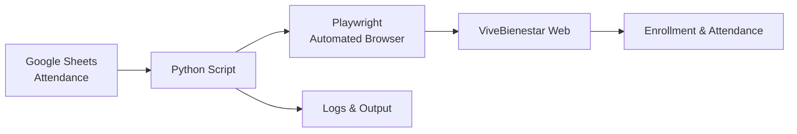

<h1 align="center">Dávila Wellness Automation</h1>
<h3 align="center">
Full automation to enroll and register attendance for employees in Clínica Dávila’s wellness programs.
</h3>
<p align="center"><i>Built with Python → Playwright → Google Sheets</i></p>

---

## Project Description

This project automates the daily workflow:

1. Reads participant data from Google Sheets based on date.  
   <br>**Example of Input Sheet (Fictitious):**  
   

2. Automatically opens the ViveBienestar portal.
3. Logs in as an instructor.
4. Navigates through:
   - Clínica Dávila  
   - Building  
   - Section  
   - Program (Gimnasia Laboral or others)
5. Attempts to enroll participants using:
   - **Plan A:** Quick popup using only RUT  
   - **Plan B:** Full modal form if the popup fails
6. Detects whether a participant is already enrolled.
7. Marks attendance only for participants scheduled on the given day.
8. Submits attendance records.
9. Prints clear logs with details, errors, and results.

This bot works even with:
- Annoying overlays  
- Pagination  
- Changing forms  
- Slow system response  
- RUT written in inconsistent formats  

---

## System Architecture


## Technologies Used

- Python 3.10+
- Playwright (web automation)
- gspread + Google API (Sheets)
- dotenv (secure credential handling)
- Regular Expressions (flexible RUT validation)
- Advanced error tolerance
- Dynamic load and wait-time management

## Project Structure
```
davila-wellness-automation/
│
├── Automatizacion_Davila.py     # Main automation script
├── .gitignore                   # Secret exclusion rules
├── .env                         # Environment variables (not uploaded)
├── credentials.json             # Google credentials (not uploaded)
├── reports/                     # Optional results
└── README.md
```
### View of the Script in VS Code


### Example Environment Variables (Fictitious)


# How to Run the Project
🟢 Plan A — Quick Popup

Uses only the RUT field.
If the participant appears in the table → instant success.

🟣 Plan B — Full Modal Form

If the popup fails, the bot opens the full form and fills:
Name
RUT
Gender

Then it submits the form carefully and retries if the site fails.

Attendance Logic

Attendance is marked only for participants of the chosen date.
Attendance submission is done at the end of each section.

# Example of Real Logs
```
BUILDING C – URGENCIA SECTION — 7 participants
✔️ Already enrolled; attendance marked → Juan Soto
❌ Not found in table. Attempting enrollment…
🟢 Plan A successful → María López
➕ Enrolled and attendance marked
💾 Submitting attendance…
✔️ Attendance successfully recorded.

```
### Log Output Example  


# Bot Robustness
Automatically handles overlays.
Finds buttons in multiple ways to adapt to UI changes.
Supports dynamic pagination.
Recognizes different RUT writing formats.
Retries forms when failures occur.
Manages load times and intermediate states.

## Author

**Camila Álvarez**  
Physical Activity Specialist, Workplace Wellness & People Analytics  
GitHub: https://github.com/Cami2025

# Contact

LinkedIn: www.linkedin.com/in/camilaalvareztafs

Professional email: camianalytics5@gmail.com

---

## ⭐ Support the Project

If you found this project useful, feel free to give the repository a **⭐ star**!  
Your support helps showcase my work and encourages the creation of more analytics projects.

