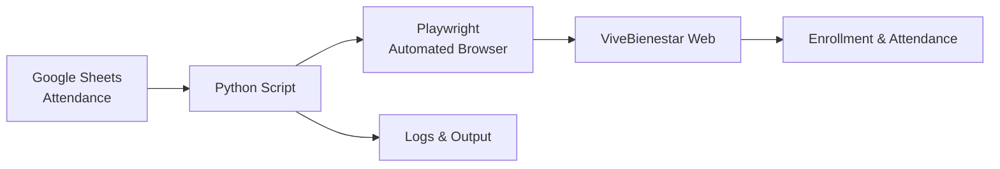

# Dávila Wellness Automation  
Full automation to enroll and register attendance for employees in Clínica Dávila’s wellness programs.  
Built with Python + Playwright + Google Sheets.

---

## 🎥 Video Demo  
> *(You will add your link tomorrow)*  
> 🔗 https://youtu.be/YOUR_VIDEO  

---

## Project Description

This project automates the daily workflow:

1. Reads participant data from Google Sheets based on date.
2. Automatically opens the ViveBienestar portal.
3. Logs in as an instructor.
4. Navigates through:
   - Clínica Dávila  
   - Building  
   - Section  
   - Program (Gimnasia Laboral or others)
5. Attempts to enroll participants using:
   - **Plan A:** Quick popup using only RUT  
   - **Plan B:** Full modal form if the popup fails
6. Detects whether a participant is already enrolled.
7. Marks attendance only for participants scheduled on the given day.
8. Submits attendance records.
9. Prints clear logs with details, errors, and results.

This bot works even with:
- Annoying overlays  
- Pagination  
- Changing forms  
- Slow system response  
- RUT written in inconsistent formats  

---

## System Architecture

## Technologies Used

Python 3.10+
Playwright (web automation)
gspread + Google API (Sheets)
dotenv (secure credential handling)
Regular Expressions (flexible RUT validation)
Advanced error tolerance
Dynamic load and wait-time management
